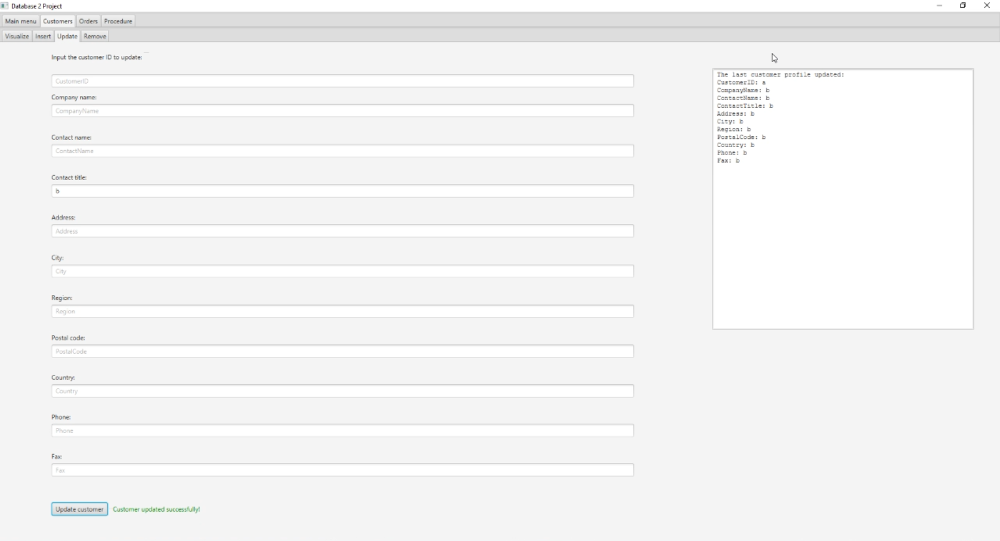

### Database project made with Java, javafx, SQL server and Northwind template
    + The app makes CRUD operations with customer table.
    + Read and insert orders with multiple products.
    + Execute a database procedure.
### Creators: 
    Hector de Oliveira Pinheiro:
        + GUI application
        + Customer and Orders features
    Mario Filipe:
        + Procedure and trigger logic

## App images
    

    